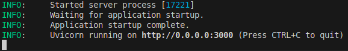
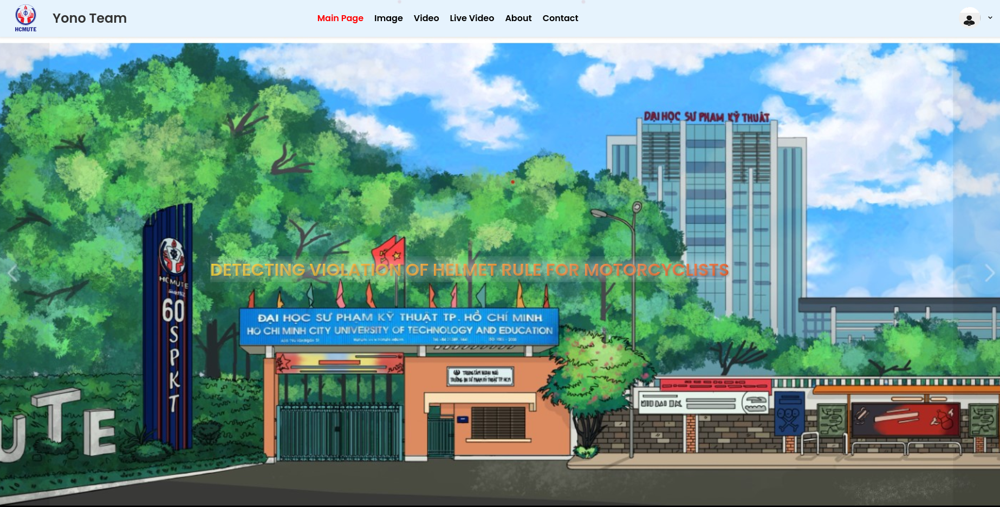
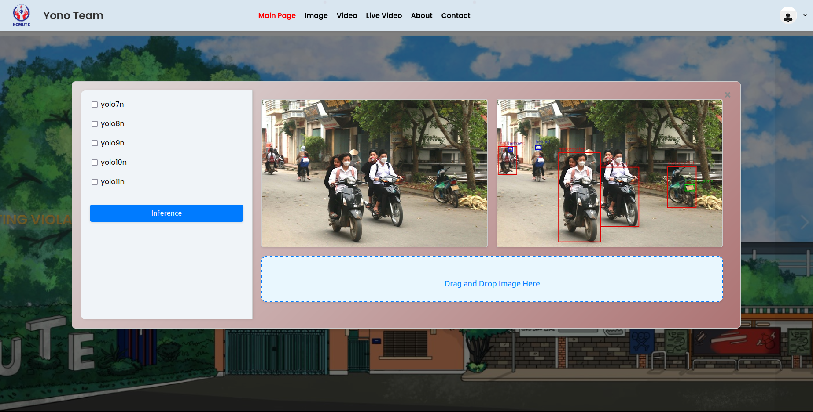

# How-to Guide
This repo is about a system, which is automatically detect the motorcylist without a helmet. There is a website to run demo as below.

## Dataset used

The dataset used for training was taken from [track 5](https://www.aicitychallenge.org/2024-challenge-tracks/) of AI CITY CHALLENGE competition.

## Serving models
Create a conda enviroment, and activate your enviroment. This project was doned in python version 3.9
```shell
conda create -n helmet_demo python=3.9 -y
conda activate helmet_demo
```
Install all the packages
```shell
pip install -r requirements.txt
```
Start your server by running the following commands:

```shell
cd Detecting-Violation-of-Helmet-Rule-for-Motorcyclists-/
uvicorn main:app --host 0.0.0.0 --port 3000
```
**Output of terminal**


## Run user interface
By clicking into file `index.html`, login with email `admin@gmail.com` and password `admin` . You are ready to go. Here is quick view of UI.

**Login Screen**


**Main Screen**


**Image Predict**

## Video Demo
[](https://raw.githubusercontent.com/TrieuDinhHo/Detecting-Violation-of-Helmet-Rule-for-Motorcyclists-/main/image/20240806_202124.mp4)
